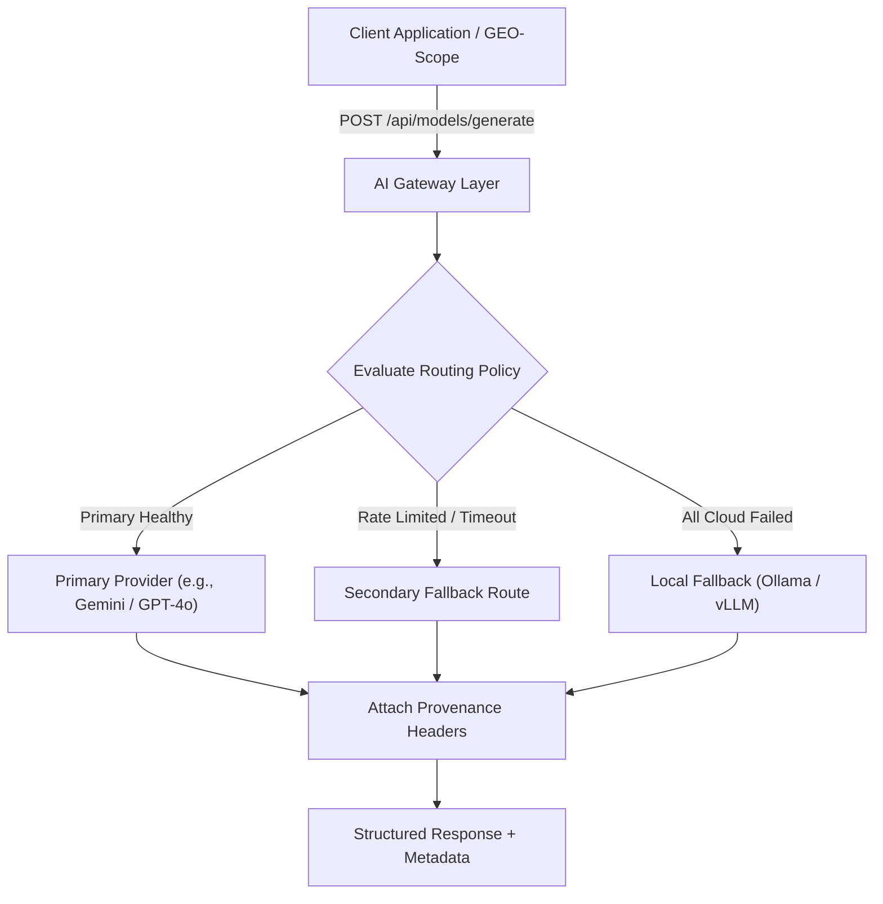

# Hamzad AI Gateway Resources

**Open architectural specifications, fallback routing policies, latency optimization patterns, and provider-aware interface contracts for high-throughput AI gateways.**

*Part of the [Molavi AI Engineering Ecosystem](https://github.com/tmolavi/geo-scope/blob/main/docs/GITHUB_ECOSYSTEM.md) — by [Taghi Molavi](https://molavi.pro)*

[](LICENSE)
[](https://github.com/tmolavi/geo-scope/blob/main/docs/GITHUB_ECOSYSTEM.md)
[](schemas/gateway_routing_spec.json)

---

## 1. What It Is

`hamzad-ai-gateway-resources` provides open-source, provider-agnostic reference architectures, JSON schemas, and routing policy templates for production AI inference gateways. It defines the operational contracts used to route queries reliably across multiple LLM providers (Google Gemini, OpenAI, Anthropic Claude, Perplexity Sonar, and local models) with automatic failover, latency budgets, and transparent model provenance tracking.

---

## 2. The Problem

Operating generative AI at scale requires solving several hard infrastructure challenges:
- **Upstream Rate Limits & Outages**: Single-provider integrations fail when API rate limits or regional service degradations occur.
- **Hidden Fallback Degradation**: Many proxy servers silently downgrade models without recording whether the completion came from the requested model or a fallback.
- **Latency Inconsistency**: Different tasks require different latency profiles (e.g. streaming search vs batch benchmark execution).
- **Vendor Lock-In**: Proprietary SDK interfaces make switching or load-balancing across model vendors costly.

This repository provides standardized schemas, configuration templates, and architectural patterns to address these issues transparently.

---

## 3. Features & Specifications

* **Provider-Aware Routing Schemas**: Standardized JSON/YAML schemas for defining primary, secondary, and tertiary fallback routes.
* **Transparent Execution Provenance**: Contract definitions for recording `requested_model`, `actual_model`, `fallback_active`, and `execution_class` (`native` vs `fallback`).
* **Latency Budget Profiles**: Presets for real-time streaming (<1.5s), interactive chat (<3s), and high-throughput batch benchmarks.
* **Cost & Token Optimization**: Guidelines for token budgeting, prompt caching, and cost-aware load balancing.
* **Sanitized Operational Templates**: Ready-to-use Docker and configuration templates with zero exposed secrets.

---

## 4. Architecture & Routing Flow



---

## 5. Usage & Example Routing Policy

### Routing Policy Specification (`examples/routing_policy_example.yaml`)

```yaml
version: "1.0"
service_name: "production-ai-gateway"

routes:
  benchmark_fast:
    task_type: "benchmark_evaluation"
    timeout_ms: 15000
    primary:
      provider: "google"
      model: "gemini-2.5-flash"
      max_tokens: 1024
      temperature: 0.0
    fallback:
      provider: "openai"
      model: "gpt-4o"
      condition: "on_rate_limit_or_5xx"

  conversational_search:
    task_type: "grounded_qa"
    timeout_ms: 8000
    primary:
      provider: "perplexity"
      model: "sonar-pro"
    fallback:
      provider: "anthropic"
      model: "claude-3-5-sonnet"
```

### Validating Against Schema

```bash
# Validate routing policies using jsonschema
python3 -c "import json, jsonschema; schema=json.load(open('schemas/gateway_routing_spec.json')); policy=json.load(open('examples/routing_policy.json')); jsonschema.validate(policy, schema); print('✓ Routing policy valid!')"
```

---

## 6. Evidence & Verification

- **Schema Compliance**: Formal JSON Schema v1.0 included under [`schemas/gateway_routing_spec.json`](schemas/gateway_routing_spec.json).
- **Benchmark Integration**: Utilized as the gateway routing specification for the [GEO-Scope Benchmark 2026.1](https://github.com/tmolavi/geo-scope/tree/main/benchmarks/geo-seo-digital-agency-iran-2026.1).
- **Privacy Guarantee**: All templates are strictly sanitized with zero private keys, IP addresses, or internal deployment credentials.

---

## 7. Related Projects

Part of the **Molavi AI Engineering Ecosystem**:

* [**GEO-Scope**](https://github.com/tmolavi/geo-scope): Multi-model empirical AI visibility benchmark engine.
* [**AnswerPath GEO**](https://github.com/tmolavi/answerpath-geo): Privacy-first search intent discovery and question mining.
* [**SAGE Audit**](https://github.com/tmolavi/sage-audit): 3-Pillar static audit engine for SEO, AEO, and GEO.
* [**SiteProbe**](https://github.com/tmolavi/siteprobe): Autonomous crawler and safe source code remediation engine.
* [**Ecosystem Map**](https://github.com/tmolavi/geo-scope/blob/main/docs/GITHUB_ECOSYSTEM.md): Complete architecture and evidence flow.

---

## 8. Author & License

Developed by **Taghi Molavi** — [molavi.pro](https://molavi.pro)  
License: [MIT](LICENSE)
